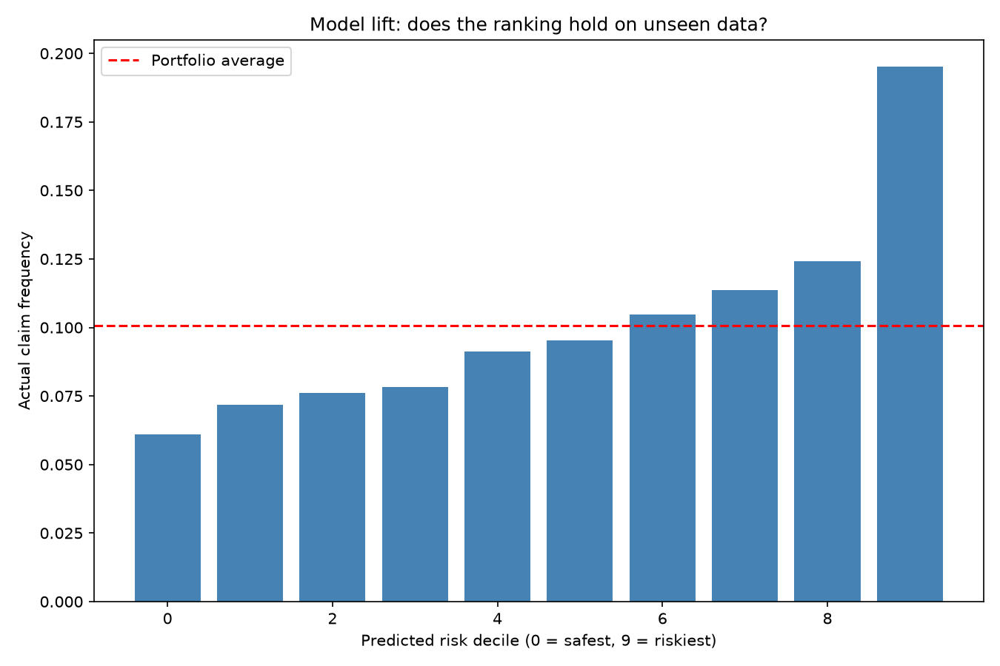

# Insurance Claim Frequency Prediction
Predicting motor insurance claim frequency from policyholder and vehicle
characteristics, using a French third-party liability portfolio of
approximately 678,000 policies.

## Research question
Which policyholder and vehicle characteristics best predict whether a
customer will file a claim, and what does that imply for pricing?

## Key findings
- Exposure adjusted portfolio claim frequency: 0.1006 claims per year
- Test set Gini: 0.19 (ROC-AUC 0.59)
- Riskiest predicted decile claims at 3.19 the rate of the safest decile
- Strongest predictors: bonus-malus, driver age, population density

## Data
French Motor Third-Party Liability (freMTPL2freq), approximately 678,000
policies, 2011-2013. Source: OpenML dataset 41214, licensed CC0.
Originally from the R package CASdatasets (Dutang & Charpentier, 2018).

Raw data is not committed to this repository. Running src/01_get_data.py
downloads it automatically into data/raw/.

## Running this project
pip install -r requirements.txt
python src/01_get_data.py
python src/02_explore.py
python src/03 _model.py

## Repository structure
data/raw/               Downloaded source data (gitignored)
data/processed/         Cleaned analysis file (gitignored)
excel/                  20,000-row sample for spreadsheet exploration
src/                    Analysis scripts, run in numeric order
outputs/figures/        Generated charts
docs/                   Written report

## Author
Izabella Kowalczyk - github.com/izakowal28